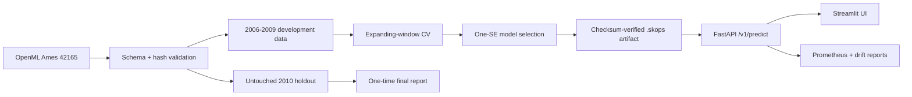

# Historical Ames House Price System

A portfolio-quality ML system that simulates a production deployment in 2010. It trains only
on Ames sales from 2006-2009, validates with expanding time windows, and evaluates once on the
untouched 2010 cohort.

> **Important:** every prediction is a historical estimate in approximately 2010 US dollars.
> This project must not be used for present-day valuations, lending, tax, or investment decisions.

## What this demonstrates

- Leakage-resistant temporal evaluation (`2006->2007`, `2006-07->2008`, `2006-08->2009`).
- One shared, validated 21-feature contract for training, API inference, and the UI.
- Fold-local imputation/encoding, simple-model selection, smearing-corrected inversion, and
  empirical 90% prediction intervals.
- Checksum-verified, allowlisted `skops` model loading and strict JSON provenance.
- FastAPI, Streamlit, Prometheus metrics, structured request logs, Docker Compose, and CI.
- Offline drift, novelty, range, prediction-shift, and delayed-label performance reports.

## Architecture



## Reproduce locally

Requires Python 3.11 or 3.12.

```powershell
python -m venv .venv
.\.venv\Scripts\Activate.ps1
pip install -e ".[dev,ui,tracking,explain]"

house-price download
house-price validate-data
house-price train
house-price evaluate --confirm-final
pytest --cov
```

Configuration defaults to `./config/config.yaml`. When running from another working directory or
from an installed package, set `HOUSE_PRICE_CONFIG` to the config file path:

```powershell
$env:HOUSE_PRICE_CONFIG = "C:\path\to\house-price-prediction\config\config.yaml"
```

`validate-data` writes the source ID, version, canonical Parquet SHA-256, row count, columns,
temporal partition sizes, and public schema. `train` records the git commit, dependency versions,
seed, folds, model decision, residual correction, prediction bounds, and artifact checksum.

## Serve

```powershell
house-price serve
streamlit run app/streamlit_app.py
```

Or, after training has created `models/house_price_model.skops`:

```powershell
docker compose up --build
```

- API and OpenAPI: <http://localhost:8000/docs>
- UI: <http://localhost:8501>
- Metrics: <http://localhost:8000/metrics>

Example request:

```json
{
  "neighborhood": "NAmes", "zoning": "RL", "building_type": "1Fam",
  "house_style": "1Story", "overall_quality": 6, "overall_condition": 5,
  "living_area_sqft": 1500, "basement_area_sqft": 900, "lot_area_sqft": 9000,
  "garage_cars": 2, "garage_area_sqft": 450, "year_built": 1975,
  "year_remodeled": 1995, "full_bathrooms": 2, "half_bathrooms": 1,
  "bedrooms": 3, "rooms": 6, "fireplaces": 1,
  "kitchen_quality": "TA", "central_air": "Y", "valuation_year": 2010
}
```

The response includes both the historical prediction and an optional CPI-U purchasing-power
reference:

```json
{
  "predicted_price_2010_usd": 164350.18,
  "inflation_adjusted_reference_usd": 243121.62,
  "inflation_reference_year": 2025,
  "inflation_note": "Inflation-adjusted purchasing-power reference only; not a present-day market valuation, appraisal, or forecast."
}
```

The inflation-adjusted value is shown for interpretability only. It is not a current Ames market
price estimate.

## Evaluation and model card

The primary metric is log-RMSE because errors should be proportional to price. Dollar MAE,
RMSE, MAPE, R-squared, interval coverage, calibration, residuals, neighborhood slices, price-band
slices, and permutation importance are secondary diagnostics. The final model is the least
complex candidate within one standard error of the best temporal-CV result, provided it improves
at least 20% over a median baseline; otherwise the baseline ships.

Final numbers are deliberately not hard-coded here. A reproducible run writes the final temporal
holdout metrics, analysis tables, and model card artifacts under `reports/`; generated model and
data artifacts stay out of Git by design. The small checked-in comparison file at
`reports/experiments/temporal_model_comparison.csv` is an example development report. Existing
random-split results are legacy artifacts and are not evidence for the production claim.

## Drift report

```powershell
house-price drift-report --reference data/reference.parquet --current data/current.parquet
```

The report covers numeric PSI and missingness, category novelty, schema-range violations, and, if
`actual_price` and `predicted_price` are present, delayed-label log-RMSE and dollar MAE.

## Limitations

- Ames is small, historical, and geographically narrow; performance does not transfer to other
  cities or modern market regimes.
- The empirical interval captures model residuals in historical validation, not all sources of
  appraisal uncertainty.
- Fairness slices are constrained by the non-personal attributes available in the dataset.
- Model files are loaded only after checksum verification and type allowlisting; artifacts from
  untrusted sources must still never be installed into the deployment volume.
